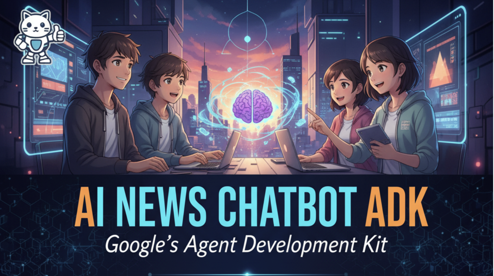

<p align="center">
  
</p>

# AI News Chatbot ADK

An intelligent AI news assistant built with Google's Agent Development Kit (ADK) that searches the web for the latest AI developments and provides accurate, up-to-date information.

## 🎯 Quick Start for Windows Beginners

**New to Python?** Follow this order:
1. [Install Python](#step-0-install-python-on-windows) (if you don't have it)
2. [Install Git](#step-02-install-git-for-windows) (if you don't have it)
3. [Clone this repository](#step-1-clone-the-repository)
4. [Set up virtual environment](#step-3-set-up-virtual-environment) 
5. [Install dependencies](#step-4-install-dependencies)
6. [Get API key and configure](#step-5-configure-api-key)
7. [Run the application](#-running-the-agent)

**Already have Python?** Skip to [Installation](#-installation) section.

## 🚀 Features

- **Real-time AI News**: Fetches the latest AI news and developments using Google Search
- **ADK Integration**: Fully compatible with Google's Agent Development Kit
- **Web Interface**: Interactive chat interface via ADK Dev UI
- **Smart Responses**: Provides concise, informative answers with sources when appropriate

## 📋 Prerequisites

### All Platforms
- Python 3.10+ (3.12 recommended)
- Google API key from [Google AI Studio](https://ai.google.dev/)
- Git

### Platform-Specific Requirements

#### macOS
- Homebrew (for package management)
- Command Line Tools: `xcode-select --install`

#### Windows
- Python from [python.org](https://www.python.org/) or Microsoft Store
- Git Bash or PowerShell
- Visual Studio Build Tools (for some Python packages)

## 🪟 Windows Setup Guide (For Beginners)

If you're new to Python development on Windows, follow these detailed steps:

### Step 0: Install Python on Windows

#### Option 1: Download from python.org (Recommended)
1. **Download Python**:
   - Go to https://www.python.org/downloads/
   - Click the yellow "Download Python 3.12.x" button (latest version)
   - Save the installer file

2. **Install Python**:
   - Run the downloaded installer
   - ⚠️ **IMPORTANT**: Check "Add Python to PATH" at the bottom
   - Click "Install Now"
   - Wait for installation to complete
   - Click "Close" when finished

3. **Verify Python Installation**:
   - Press `Windows + R`, type `cmd`, press Enter
   - Type: `python --version`
   - You should see: `Python 3.12.x` (or similar)
   - Type: `pip --version`
   - You should see pip version information

#### Option 2: Microsoft Store (Alternative)
1. Open Microsoft Store
2. Search for "Python 3.12" 
3. Click "Get" or "Install"
4. After installation, verify as above

#### Troubleshooting Python Installation
If `python --version` doesn't work:
- Restart Command Prompt/PowerShell
- Restart your computer
- Reinstall Python with "Add to PATH" checked

### Step 0.1: Upgrade pip (Important)
```cmd
# Upgrade pip to latest version
python -m pip install --upgrade pip
```

### Step 0.2: Install Git for Windows
1. **Download Git**:
   - Go to https://git-scm.com/download/win
   - Download and run the installer
   - Use default settings, click "Next" through all screens
   - Click "Install"

2. **Verify Git Installation**:
   ```cmd
   git --version
   ```

### Step 0.3: Optional - Install uv Package Manager (Advanced)
`uv` is a faster Python package manager. This is optional but recommended for advanced users:

#### Install uv on Windows:
```powershell
# Option 1: Using PowerShell (Recommended)
powershell -ExecutionPolicy ByPass -c "irm https://astral.sh/uv/install.ps1 | iex"

# Option 2: Using pip
pip install uv
```

#### Verify uv Installation:
```cmd
uv --version
```

#### Using uv instead of pip:
If you have uv installed, you can replace `pip install` commands with `uv pip install` for faster installations:
```cmd
# Instead of: pip install -r requirements.txt
uv pip install -r requirements.txt

# Instead of: pip install google-adk
uv pip install google-adk
```

## 🛠️ Installation

### Step 1: Clone the Repository

#### All Platforms
```bash
git clone https://github.com/rajeshkanaka/adk_practice.git
cd adk_practice
```

#### Windows Users - Alternative using File Explorer:
1. Go to https://github.com/rajeshkanaka/adk_practice
2. Click the green "Code" button
3. Click "Download ZIP"
4. Extract the ZIP file to your desired location (e.g., `C:\Projects\`)
5. Open Command Prompt or PowerShell
6. Navigate to the extracted folder:
   ```cmd
   cd C:\Projects\adk_practice
   ```

**Note**: Make sure you're in the correct directory before proceeding. You should see files like `README.md`, `requirements.txt`, etc.

### Step 2: Install ADK (Google Agent Development Kit)

#### All Platforms (Standard Method)
```cmd
pip install --upgrade google-adk
```

#### Windows with uv (If you installed uv)
```cmd
uv pip install --upgrade google-adk
```

#### Verify Installation
```cmd
# Check if ADK is installed correctly
python -c "import google.adk; print('ADK installed successfully!')"
```

If you see "ADK installed successfully!", continue to the next step.

### Step 3: Set Up Virtual Environment

⚠️ **Important**: Always use virtual environments to avoid conflicts between Python packages.

#### macOS/Linux
```bash
# Create virtual environment
python3 -m venv .venv

# Activate virtual environment
source .venv/bin/activate
```

#### Windows (Command Prompt) - Recommended for Beginners
```cmd
# Create virtual environment
python -m venv .venv

# Activate virtual environment
.venv\Scripts\activate.bat

# You should see (.venv) at the beginning of your command prompt
```

#### Windows (PowerShell)
```powershell
# Create virtual environment
python -m venv .venv

# Activate virtual environment
.venv\Scripts\Activate.ps1

# If you get an execution policy error, run this first:
Set-ExecutionPolicy -ExecutionPolicy RemoteSigned -Scope CurrentUser
```

#### Verify Virtual Environment is Active
After activation, you should see `(.venv)` at the beginning of your command prompt. You can also verify:
```cmd
# Check Python path - should point to .venv folder
where python  # Windows
which python  # macOS/Linux
```

### Step 4: Install Dependencies

⚠️ **Make sure your virtual environment is activated** (you should see `(.venv)` in your prompt)

#### Standard Method (All Platforms)
```cmd
pip install -r requirements.txt
```

#### Using uv (Faster - if you installed uv)
```cmd
uv pip install -r requirements.txt
```

#### Verify Installation
```cmd
# Check if key packages are installed
python -c "import google.adk, streamlit, fastapi; print('All dependencies installed successfully!')"
```

#### If Installation Fails on Windows
Some Python packages need Visual Studio Build Tools. Install them:
1. Go to https://visualstudio.microsoft.com/visual-cpp-build-tools/
2. Download "Build Tools for Visual Studio"
3. Install with "C++ build tools" workload selected
4. Restart Command Prompt and try installing dependencies again

### Step 5: Configure API Key

#### Get Your Google API Key First
1. Go to [Google AI Studio](https://ai.google.dev/)
2. Sign in with your Google account
3. Click "Get API Key" 
4. Create a new API key and copy it

#### macOS/Linux
```bash
# Copy environment template
cp .env.example .env

# Edit .env file with your favorite editor
nano .env  # or vim, code, etc.
```

#### Windows (Command Prompt/PowerShell)
```cmd
# Copy environment template
copy .env.example .env

# Edit .env file with Notepad
notepad .env
```

#### Windows Alternative - Create .env manually:
1. Open File Explorer and navigate to your project folder
2. Right-click in empty space → New → Text Document
3. Name it `.env` (remove the .txt extension)
4. Right-click the .env file → Open with → Notepad
5. Copy and paste this template:

```env
# Replace with your actual Google API key from https://ai.google.dev/
GOOGLE_API_KEY='your_actual_api_key_here'

# Set to FALSE to use Google AI Studio API
GOOGLE_GENAI_USE_VERTEXAI=FALSE
```

6. Replace `your_actual_api_key_here` with your actual API key
7. Save the file (Ctrl+S)

#### Verify API Key Setup
```cmd
# Check if .env file exists and has content
type .env  # Windows
cat .env   # macOS/Linux
```

## 🚀 Running the Agent

⚠️ **Before running**: Make sure your virtual environment is activated (`(.venv)` should be visible in your prompt)

### Option 1: Using ADK Web Interface (Recommended)

#### All Platforms
```cmd
# Run the ADK web interface
python -m google.adk.cli web
```

#### Alternative Command (if the above doesn't work)
```cmd
adk web
```

### Option 2: Using Provided Scripts

#### macOS/Linux
```bash
# Make script executable (first time only)
chmod +x run.sh

# Run the ADK web interface
./run.sh
```

#### Windows - Create Your Own Run Script
Since Windows doesn't have shell scripts, create a batch file:
1. Create a new file called `run.bat` in your project folder
2. Add this content:
```batch
@echo off
echo Starting AI News Chatbot ADK...
call .venv\Scripts\activate.bat
python -m google.adk.cli web
pause
```
3. Double-click `run.bat` to run the application

### Option 3: Streamlit Interface (Alternative UI)

#### All Platforms
```cmd
# Install streamlit if not already installed
pip install streamlit

# Run Streamlit interface
streamlit run streamlit_app.py
```

#### Using uv (if installed)
```cmd
# Install streamlit with uv
uv pip install streamlit

# Run Streamlit interface
streamlit run streamlit_app.py
```

## 🌐 Accessing the Agent

Once running, access your AI News Chatbot at:

- **ADK Dev UI**: http://localhost:8000/dev-ui/
- **API Endpoint**: http://localhost:8000/apps/ai_news_chatbot_adk
- **Streamlit UI** (if using): http://localhost:8501

## 💬 Example Queries

Try these prompts to test your agent:

- "What are the latest developments in generative AI?"
- "Tell me about recent breakthroughs in AI research"
- "What's new with OpenAI or Google's AI models?"
- "How is AI being used in healthcare recently?"
- "What are the latest AI ethics concerns?"
- "Give me AI news from the last week"

## 📁 Project Structure

```
adk_practice/
├── ai_news_chatbot_adk/           # ADK package directory
│   ├── __init__.py                # Package initialization with root_agent
│   └── agent.py                   # Main AI News Agent definition
├── backend_server.py              # FastAPI backend server
├── streamlit_app.py               # Streamlit web interface
├── .env.example                   # Environment variables template
├── .env                           # Your API keys (create from .env.example)
├── requirements.txt               # Python dependencies
├── run.sh                         # macOS/Linux runner script
├── run.bat                        # Windows runner script (created)
├── run_all.sh                     # Run both backend and frontend
├── run_backend.sh                 # Backend runner script
├── run_frontend.sh                # Frontend runner script
├── Git_helper.md                  # Git setup guide for Windows
├── SETUP_GUIDE.md                 # Additional setup information
└── README.md                      # This file
```

## 🔧 Troubleshooting

### Windows-Specific Issues

#### 1. "python is not recognized"
If you get this error, Python isn't in your PATH:
- Reinstall Python from python.org with "Add Python to PATH" checked
- Or manually add Python to PATH in System Environment Variables
- Restart Command Prompt after making changes

#### 2. "pip is not recognized" 
```cmd
# Try using python -m pip instead
python -m pip --version

# If that works, use python -m pip install instead of pip install
python -m pip install google-adk
```

#### 3. Virtual Environment Not Activating
```cmd
# Make sure you're in the right directory
dir .venv

# Try the full path
.venv\Scripts\activate.bat

# For PowerShell, you might need to enable scripts first:
Set-ExecutionPolicy -ExecutionPolicy RemoteSigned -Scope CurrentUser
```

#### 4. "Microsoft Visual C++ 14.0 is required"
Some Python packages need build tools:
1. Install Visual Studio Build Tools from https://visualstudio.microsoft.com/visual-cpp-build-tools/
2. Select "C++ build tools" workload
3. Restart and try again

#### 5. Port Issues on Windows
```cmd
# Find what's using port 8000
netstat -ano | findstr :8000

# Kill the process (replace PID with actual process ID)
taskkill /PID <PID_NUMBER> /F

# Or use a different port
python -m google.adk.cli web --port 8001
```

### Common Issues and Solutions

#### 1. Agent Not Discoverable in ADK Web
- Ensure the `ai_news_chatbot_adk` subdirectory exists with proper `__init__.py`
- Check that `root_agent` is properly exported in `__init__.py`
- Restart the ADK server after making changes

#### 2. API Key Issues
- Verify your API key is correctly set in `.env`
- Ensure the `.env` file has proper quotes around the API key
- Check that you're using a valid Google AI Studio API key
- Make sure there are no extra spaces or hidden characters

#### 3. Windows PowerShell Execution Policy
If you get an error about execution policies:
```powershell
Set-ExecutionPolicy -ExecutionPolicy RemoteSigned -Scope CurrentUser
```

#### 4. Port Already in Use
If port 8000 is already in use:
```bash
# Kill the process using port 8000
# macOS/Linux
lsof -ti:8000 | xargs kill -9

# Windows
netstat -ano | findstr :8000
taskkill /PID <PID_NUMBER> /F
```

#### 5. Module Import Errors
Ensure your virtual environment is activated:
```cmd
# Check if virtual environment is active
which python  # macOS/Linux
where python  # Windows

# Should show path within .venv directory
# Windows should show something like: C:\path\to\your\project\.venv\Scripts\python.exe
```

#### 6. uv Package Manager Issues
If you're using uv and get errors:
```cmd
# Make sure uv is installed
uv --version

# Try using regular pip instead
pip install -r requirements.txt

# Or reinstall uv
pip install --upgrade uv
```

#### 7. Windows Defender/Antivirus Blocking
If Windows Defender or antivirus software blocks Python:
- Add your project folder to Windows Defender exclusions
- Add Python installation folder (usually `C:\Users\YourName\AppData\Local\Programs\Python\`) to exclusions
- Temporarily disable real-time protection during installation
- Choose "Allow" when Windows SmartScreen shows warnings about Python scripts

## 🤝 Contributing

Contributions are welcome! Please feel free to submit a Pull Request.

## 📄 License

This project is licensed under the Apache License 2.0 - see the LICENSE file for details.

## 🔗 Resources

- [Google Agent Development Kit Documentation](https://google.github.io/adk-docs/)
- [Google AI Studio](https://ai.google.dev/)
- [ADK Python SDK](https://pypi.org/project/google-adk/)
- [ADK Samples](https://github.com/google/adk-samples)

## 📞 Support

For issues or questions:
- Check the [Troubleshooting](#-troubleshooting) section
- Review ADK documentation at https://google.github.io/adk-docs/
- Open an issue in the repository

## License

This project is licensed under the Apache License 2.0 - see the LICENSE file for details.
